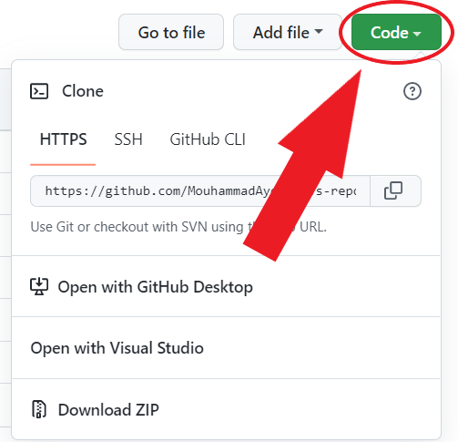

<a name="readme-top"></a>


# My-React-App</br>&nbsp;&nbsp;&nbsp;

> Welcome aboard fellow developer, this is where you will find projects which you are free to contribute to. You can contribute by submitting your own scripts, which you think would be amazing for other people to see.

## Description

test

## Installation

Download the project from github to your desktop:

- **With Git** :
  If you’re familiar with git and have it installed on your computer, you can clone the repository to download the files.
  **1.** Click the green button labeled &nbsp;`Code`</br>
  &nbsp;&nbsp;&nbsp;&nbsp;&nbsp;&nbsp;&nbsp;&nbsp;&nbsp;&nbsp;&nbsp;&nbsp;&nbsp;&nbsp;&nbsp;&nbsp;</br>
  **2.** Copy the URL of the repository</br>
  **3.** Next, on your local machine, open your bash shell and change your current working directory to the location where you would like to clone your repository

  ```shell
  cd "path-to-your-folder"
  ```

  **4.** Once you have navigated to the directory where you want to put your repository, you can use

  ```shell
  git clone https://github.com/MouhammadAyoub/My-React-App.git
  ```

  **5.** When you run `git clone https://github.com/MouhammadAyoub/My-React-App.git`, You should see output like

  ```shell
  Cloning into 'test-repo'...
  remote: Counting objects: 5, done.
  remote: Compressing objects: 100% (4/4), done.
  remote: Total 5 (delta 0), reused 0 (delta 0), pack-reused 0
  Unpacking objects: 100% (5/5), done.
  Checking connectivity... done.
  ```

    </br>

- **Without Git** :
  When downloading materials to your laptop, it is easiest to download the entire repository.

  **1.** Click on the green `Code` button, then download the repository as a ZIP file</br>

  &nbsp;&nbsp;&nbsp;&nbsp;&nbsp;&nbsp;&nbsp;&nbsp;&nbsp;&nbsp;&nbsp;&nbsp;&nbsp;&nbsp;&nbsp;&nbsp;</br>

  **2.** Find the downloaded .zip file on your computer, likely in your Downloads folder</br>

  **3.** Unzip it, this will create a folder named after the GitHub repository</br></br>

- **Steps you must do to make the system work properly** :

  

<p align="right">(<a href="#readme-top">back to top</a>)</p>

## Usage

- **_Exercice 1 :_** &nbsp;The first step you need to do is to use the desktop application in Exercise 1 to `Encrypt The File` you want to send

</br>

**_Note :_** &nbsp;This is the content of the `File` we need to encrypt

</br>

**_Note :_** &nbsp;Once you choose the file to be encrypted, the Save button will become clickable, and by clicking on it you can choose where you want to save the encrypted file

</br>

**_Note :_** &nbsp;This is the content of the file that we saved `After Encrypting It`

</br>

- **_Exercice 2 :_** &nbsp;The Exercise 2 is a Python script whose job is to `Decrypt The File` we just encrypted by receiving two arguments, the first is the path of the file we need to decrypt and the second is the path where we want to save the result, but we can't use it alone because it doesn't have a user interface, so we'll use it in Exercise 5 later

&nbsp;&nbsp;&nbsp;&nbsp;&nbsp;&nbsp;&nbsp;&nbsp;&nbsp;&nbsp;&nbsp;&nbsp;&nbsp;&nbsp;&nbsp;&nbsp;&nbsp;

- **_Exercice 3 :_** &nbsp;This is our web API which contains API functions that we have to use in other applications, and it is also the intermediate place where the file will be stored between office A and office B

</br>

**_Note :_** &nbsp;We have a `GetToken` function which provides strong site security without which authentication cannot succeed, and anyone who doesn't have a username and password or enter wrong values can't get the token

</br>

**_Note :_** &nbsp;We have an `UploadFiles` function that enables us to upload many files and store them in the web app by just giving the paths to these files

</br>

**_Note :_** &nbsp;We also have a `DownloadFile` function which enables us to download the file from the web application simply by entering its name

</br>

- **_Exercice 4 :_** &nbsp;The function of this desktop application is to `Send The Files` of our choice to the web application for the purpose of storing it

</br>

**_Note :_** &nbsp;Once the file is selected (of course we have to choose one of the files that we have already encrypted using the ثxercice 1 application), the `Send Button` will be clickable, and by clicking on it you will be able to send the file to the web application.

</br>

- **_Exercice 5 :_** &nbsp;The function of this application is to allow Office B to `Download Encrypted Files` that Office A has uploaded to the web application

</br>

**_Note :_** &nbsp;Once the file name is entered (we did not put a drop down list of the file names on the web application in order to maintain high security, so the user must enter the file name accurately), the `Download Button` will be clickable, and by clicking on it will not only download the file, but also decrypt it by implicitly using the Python script in Exercise 2.

</br>

<p align="right">(<a href="#readme-top">back to top</a>)</p>

## Contribution Guidelines

The contribution guidelines are as per the guide [HERE](https://github.com/MouhammadAyoub/My-React-App/blob/main/CONTRIBUTING.md).

<p align="right">(<a href="#readme-top">back to top</a>)</p>

## Instructions

- Fork this repository
- Clone your forked repository
- Add your scripts
- Commit and push
- Create a pull request
- Star this repository
- Wait for pull request to merge
- Celebrate your first step into the open source world and contribute more

<p align="right">(<a href="#readme-top">back to top</a>)</p>

## License

Distributed under the MIT License. See [`LICENSE`](https://github.com/MouhammadAyoub/My-React-App/blob/main/LICENSE) for more information.  
Copyright © 2022, Mohammad Ayoub

<p align="right">(<a href="#readme-top">back to top</a>)</p>

## Contact

- Email&nbsp;&nbsp;&nbsp;&nbsp;&nbsp;&nbsp;&nbsp;&nbsp;&nbsp;&nbsp;&nbsp;:&nbsp;&nbsp;[mouhammad.ayoub@outlook.com](mailto:mouhammad.ayoub@outlook.com)

- Project Link : &nbsp;[https://github.com/MouhammadAyoub/My-React-App](https://github.com/MouhammadAyoub/My-React-App)

<p align="right">(<a href="#readme-top">back to top</a>)</p>

## Additional tools to help you get Started with Open-Source Contribution

- [How to Contribute to Open Source Projects – A Beginner's Guide](https://www.freecodecamp.org/news/how-to-contribute-to-open-source-projects-beginners-guide/)
- [How to Write a Good README File for Your GitHub Project](https://www.freecodecamp.org/news/how-to-write-a-good-readme-file/)

#### Note: When you add a project, add it to the README for ease of finding it.

#### Note: Please do not have the project link reference your local forked repository. Always link it to this repository after it has been merged with main.

<p align="right">(<a href="#readme-top">back to top</a>)</p>

---
